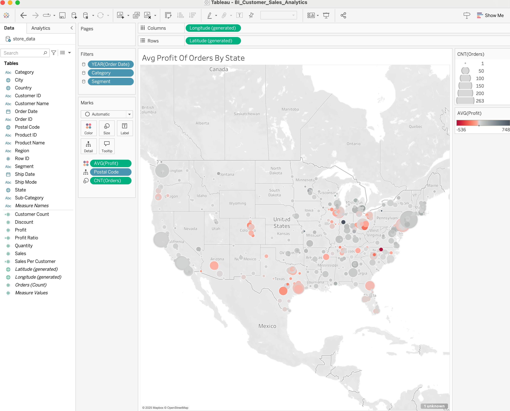
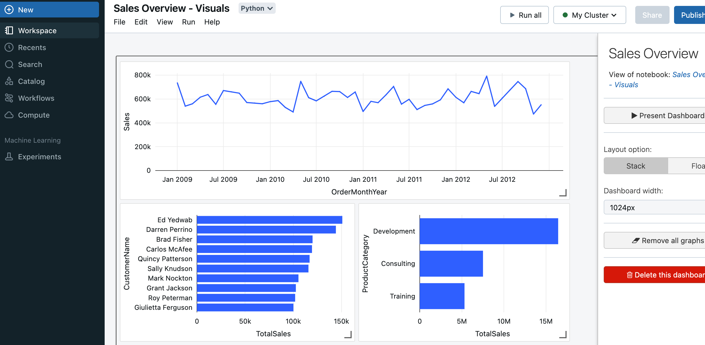
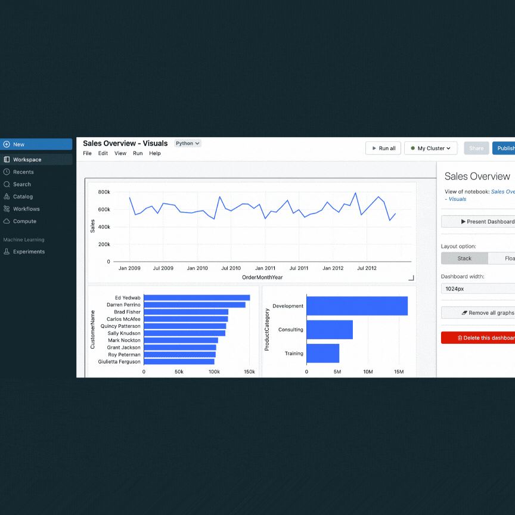

#  Office Products - Data Analytics & Analysis:

This project explores **employee, store, and product datasets** using **SQL, Python (Jupyter Notebook), Apache Spark (Databricks), and Tableau** to extract meaningful business insights. The analysis involves data **exploration, transformation, visualization, and dashboarding** to drive data-informed decision-making.

### Business Challenge: 
Retail sales performance varies across regions & product lines, impacting profitability. Understanding revenue distribution, customer behavior, & workforce trends is critical for optimizing business strategy & driving scalable growth

### Problem Statement: 
How can we leverage data-driven insights to optimize sales strategies, streamline inventory distribution, & improve workforce retention?

---

##  Table of Contents
- [🎯 Objectives](#-objectives)
- [📌 Key Takeaways](#-key-takeaways)
- [📊 Live Dashboards](#-live-dashboards)
- [🔍 Analysis and Insights](#-analysis-and-extracted-insights)
- [🛠️ Tools and Technologies](#-tools-and-technologies)
- [📈 Data Pipeline](#-data-pipeline)
- [🚀 Future Work](#-future-work)

---

##  **Objectives**
- **Workforce Analysis:** Employee hiring trends and retention metrics.
- **Product Performance Analysis:** Identifying high-performing products and underutilized segments.
- **Sales & Customer Insights:** Evaluating trends, top customers, and revenue drivers.
- **Geographical Profitability:** Visualizing store performance and profit distribution.

---

##  Key Takeaways
- **Revenue distribution is highly skewed**, with **a few high-value transactions driving total sales**, highlighting **reliance on large purchases**.
- **Sales are concentrated in a few high-performing products**, creating **inventory optimization opportunities** for low-performing categories.
- **Customer revenue distribution is uneven**, with a **small subset of high-value customers driving most sales**, emphasizing the need for **better retention strategies**.
- **Regional sales performance is inconsistent**, with **geographic profitability disparities**, suggesting a need for **targeted market expansion**.
- **Training products underperform** relative to **Development & Consulting**, indicating a **need for repositioning or improved demand strategies**.
- **Workforce trends indicate stable hiring**, but **long-term retention metrics need deeper investigation**.

---
##  Live Dashboards

### Tableau:
Click the image below to view the **interactive Tableau dashboard** on Tableau Public

  

  - **Visualizes:** Profitability by region, customer segmentation, and key KPIs.

### **Databricks Dashboard: Sales Trends & Revenue Analysis**
  
  - **Tracks:** Sales trends, revenue drivers, and high-performing product categories.

###  **Databricks Notebooks (GIF Walkthrough)**  
The following **notebooks** were used to generate insights for the above dashboard:  

---

##  Analysis and Insights

### **SQL & Employee Data Analysis**
- Extracted **hiring trends** and **active employee count over time**.
- Used **date joins** to analyze workforce retention and turnover patterns.

### **Python & Jupyter Notebook Findings** *(Uses `product_sales_monthly.csv`)*
- **Sales are highly skewed**, with **a few high-value transactions disproportionately impacting revenue**.
- **Canon imageCLASS 2200 Advanced Copier** dominates sales, while **low-performing products show potential for optimization**.
- **Revenue distribution is uneven**, with **outliers significantly influencing total sales**.
- **Median annual sales remained stable, but high variance suggests reliance on large, inconsistent purchases**.

### **Databricks & SparkSQL Analysis** *(Uses `Sales_Data.csv`)*
- **Sales Trends**: Revenue **peaked mid-2010, early 2012**, followed by a decline.
- **Customer Segmentation**: Select few customers generate the highest revenue.
- **Product Performance**: **Development leads** in sales, **Consulting has growth potential**, while **Training underperforms**.
- **Recommendations**:
    - Investigate **recent sales declines**.
    - Strengthen **retention strategies** for key clients.
    - Expand **Consulting services** and refine **Training offerings**.
    - Track **market trends** to improve long-term strategy.

### **Tableau Dashboard Insights** *(Uses `store_data.xlsx`)*
- **Profitability Mapping**: A **geospatial analysis** revealed revenue concentration **varies significantly** by state.
- **Customer Analysis**: Identified **high-value customers** and ranked them by sales impact.
- **KPI Dashboard**: Evaluated **sales per customer, profit ratios, and segment-based trends**.

---

##  Tools and Technologies

- **SQL (SQLite & SparkSQL)** → Employee data queries, workforce trend analysis, and structured database interactions.
- **Python (Jupyter, Pandas, Matplotlib)** → Data transformation, exploratory analysis, and statistical insights.
- **Apache Spark (Databricks)** → Big data handling, distributed queries, and real-time analytics on product transactions.
- **Tableau** → Interactive business intelligence dashboard for geographic and KPI-based insights.

---

##  Data Pipeline

1. **Extract** → Loaded datasets from CSV & Excel files into a local database, SQL & Databricks Spark.
2. **Transform** → Cleaned and structured data, performed aggregations, and applied business logic.
3. **Visualize** → Built an interactive dashboard and charts in Tableau & Databricks.

---

##  Future Work

- **Sales Forecasting** → Develop predictive models to project future sales trends and optimize inventory management.
- **Customer Segmentation** → Use clustering algorithms to group customers by purchasing behavior and improve targeted marketing.
- **Market Expansion Analysis** → Incorporate external data (e.g., economic trends, competitor pricing) to enhance business insights.

---
